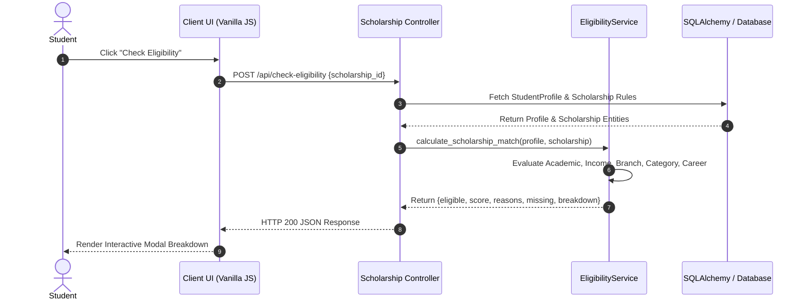

# System Architecture Documentation

## Student Career & Scholarship Portal
**A Layered, Explainable Decision Support & Opportunity Management Platform**

---

## 1. Architectural Overview

The application is engineered using a clean, multi-layered enterprise architecture designed for maintainability, testability, and deterministic decision-making:

```
+-------------------------------------------------------------------------+
|                         Presentation Layer                              |
|   HTML5 Semantic Templates + Jinja2 + Vanilla CSS3 Tokens + Chart.js    |
+-------------------------------------------------------------------------+
                                    |
                                    v
+-------------------------------------------------------------------------+
|                      Route / Controller Layer                           |
|       Flask Blueprints (Auth, Student, Scholarships, Internships,       |
|                  Courses, Applications, Career, Admin, API)             |
+-------------------------------------------------------------------------+
                                    |
                                    v
+-------------------------------------------------------------------------+
|                           Service Layer                                 |
|  - AuthService: Identity, Password Hashing & Profile Management         |
|  - EligibilityService: Multi-criteria Explainable Scoring Engine        |
|  - CareerService: 6-Dimension Readiness & Multi-Path Roadmap Engine     |
|  - RecommendationService: Weighted Opportunity Matching & Priority Hub |
|  - ApplicationService: Lifecycle Tracking & Conversion Analytics       |
|  - NotificationService: Priority Tiering & Deadline Alert System        |
|  - AnalyticsService: Live Database KPI Feeds & Funnel Metrics           |
|  - AdminService: Immutable Audit Logging & Governance CRUD Operations   |
+-------------------------------------------------------------------------+
                                    |
                                    v
+-------------------------------------------------------------------------+
|                  Repository & Data Access Layer                         |
|      SQLAlchemy ORM with Normalized Models, Constraints & Indexes       |
+-------------------------------------------------------------------------+
                                    |
                                    v
+-------------------------------------------------------------------------+
|                         Database Layer                                  |
|         SQLite (Local Development) / PostgreSQL (Production WSGI)       |
+-------------------------------------------------------------------------+
```

---

## 2. Directory Layout & Module Responsibilities

```
SCHOLARSHIP WEBSITE/
├── app.py                      # Application Factory & Security Middleware
├── config.py                   # Environment Configurations (Dev, Testing, Prod)
├── models.py                   # 3NF Relational Database Schema & Constraints
├── seed.py                     # Production-Grade Database Seeder
├── gunicorn.conf.py            # WSGI Production Server Configuration
├── Dockerfile                  # Containerization Build Specification
├── docker-compose.yml          # Container Orchestration
├── requirements.txt            # Python Dependencies
├── .env.example                # Environment Variable Template
│
├── services/                   # Business Logic & Algorithmic Engines
│   ├── __init__.py
│   ├── auth_service.py         # Authentication & Profile Service
│   ├── eligibility_service.py  # Scholarship Matching & Qualification Logic
│   ├── career_service.py       # Career Readiness & 7-Pathway Roadmaps
│   ├── recommendation_service.py # Unified Weighted Opportunity Recommendation
│   ├── application_service.py  # Pipeline Lifecycle & Conversion Rates
│   ├── notification_service.py # Tiered Notifications & Deadline Alerts
│   ├── analytics_service.py    # Live KPI Aggregations & Profile Scoring
│   └── admin_service.py        # Admin Governance & Audit Logging
│
├── routes/                     # Blueprint Route Controllers
│   ├── __init__.py             # Blueprint Registration
│   ├── auth.py                 # Login, Registration & Session Termination
│   ├── student.py              # Student Dashboard, Profile & Saved Items
│   ├── scholarships.py         # Scholarship Discovery & Eligibility
│   ├── internships.py          # Internship Catalog & Domain Search
│   ├── courses.py              # Course Catalog & Skill Filtering
│   ├── applications.py         # Application Pipeline Tracker
│   ├── career.py               # Career Simulator & Roadmap Checklist
│   ├── admin.py                # Admin Console, Analytics & Audit Logs
│   └── api.py                  # Standard REST API Layer
│
├── static/                     # Frontend Assets
│   ├── css/                    # Design System & Responsive Stylesheets
│   │   ├── style.css           # Global Tokens & Utility Classes
│   │   ├── dashboard.css       # SaaS Layout, Cards, Grids & Timeline
│   │   ├── admin.css           # Admin Tables & Governance UI
│   │   └── responsive.css      # Mobile, Tablet & Desktop Breakpoints
│   └── js/                     # Vanilla JavaScript Modules
│       ├── main.js             # Global Modals, Instant Search & Toasts
│       ├── dashboard.js        # Chart.js Renderers & Profile Meters
│       ├── scholarships.js     # Live Eligibility Modal Async Invoker
│       ├── career.js           # Target Role Simulator Controller
│       ├── roadmap.js          # Async Milestone Progress Synchronizer
│       └── admin.js            # Administrative Confirmation Modals
│
├── templates/                  # Jinja2 HTML5 Templates
│   ├── base.html               # Master Layout with Navigation & Toasts
│   ├── index.html              # Public Product Landing Page
│   ├── 404.html & 500.html     # Custom Accessible Error Pages
│   ├── auth/                   # Registration & Login Pages
│   ├── student/                # Student-Facing Views (Dashboard, Profile, etc.)
│   └── admin/                  # Admin-Facing Views (Analytics, CRUD, Audit)
│
└── tests/                      # Automated Test Suite (Pytest / Unittest)
    ├── conftest.py             # Shared Test Fixtures
    ├── test_auth_service.py    # Authentication Unit Tests
    ├── test_eligibility_engine.py # Scholarship Math & Cutoff Tests
    ├── test_career_readiness.py # Readiness Score & Skill Gap Tests
    ├── test_recommendation_engine.py # Weighted Scoring Tests
    ├── test_applications.py    # Pipeline & Conversion Rate Tests
    ├── test_admin_and_rbac.py  # RBAC & Audit Log Verification Tests
    ├── test_api.py             # REST API Endpoint Tests
    └── test_edge_cases.py      # Extreme Boundaries & Malformed Input Tests
```

---

## 3. Mathematical Algorithmic Formulations

### A. Explainable Scholarship Compatibility Formulation

$$S_{\text{total}} = S_{\text{academic}} + S_{\text{financial}} + S_{\text{branch}} + S_{\text{category}} + S_{\text{career}} + S_{\text{feasibility}}$$

Where:
1. **Academic Fit ($S_{\text{academic}} \in [0, 30]$)**:
   $$S_{\text{academic}} = \begin{cases} 25 + 5 \times \min\left(1.0, \frac{\text{CGPA}}{10}\right) & \text{if } \text{CGPA} \ge \text{Min CGPA} \\ 15 \times \frac{\text{CGPA}}{\text{Min CGPA}} & \text{if } \text{CGPA} < \text{Min CGPA} \text{ (flags ineligibility)} \end{cases}$$
2. **Financial Need Fit ($S_{\text{financial}} \in [0, 25]$)**:
   $$S_{\text{financial}} = \begin{cases} 25 & \text{if } \text{Income} \le \text{Max Income} \\ 0 & \text{if } \text{Income} > \text{Max Income} \text{ (flags ineligibility)} \end{cases}$$
3. **Branch Fit ($S_{\text{branch}} \in [0, 20]$)**:
   $$S_{\text{branch}} = \begin{cases} 20 & \text{if } \text{Synonym Match}(\text{Branch}, \text{Criteria}) = \text{True} \\ 0 & \text{if False (flags ineligibility)} \end{cases}$$
4. **Social Category Fit ($S_{\text{category}} \in [0, 10]$)**:
   $$S_{\text{category}} = \begin{cases} 10 & \text{if Category matches reservation rules} \\ 0 & \text{if False (flags ineligibility)} \end{cases}$$
5. **Career Alignment ($S_{\text{career}} \in [0, 10]$)**:
   Evaluates keyword overlap between scholarship purpose and student career goal.
6. **Feasibility ($S_{\text{feasibility}} \in [0, 5]$)**:
   Evaluates document readiness (e.g. resume URL, verified marks).

*Constraint*: If $\text{Eligible} = \text{False}$, $S_{\text{total}} \le 50$ to avoid misleading the candidate with an inappropriately high score.

---

### B. Multi-Dimensional Career Readiness Score

$$R_{\text{career}} = A_{\text{academic}} + T_{\text{skills}} + P_{\text{projects}} + C_{\text{certifications}} + D_{\text{dsa}} + L_{\text{profile}}$$

| Dimension | Max Points | Evaluation Method |
|---|---|---|
| **Academic Performance** ($A_{\text{academic}}$) | 15 pts | Scaled proportional to CGPA |
| **Technical Skill Mastery** ($T_{\text{skills}}$) | 25 pts | Weighted match against role benchmark (Adv=1.0, Int=0.8, Beg=0.6) |
| **Capstone Projects** ($P_{\text{projects}}$) | 20 pts | 1 project = 12 pts, 2+ projects = 20 pts |
| **Certifications** ($C_{\text{certifications}}$) | 10 pts | 1 cert = 6 pts, 2+ certs = 10 pts |
| **Problem Solving / DSA** ($D_{\text{dsa}}$) | 15 pts | Evaluated based on DSA skill level |
| **Profile & Links** ($L_{\text{profile}}$) | 15 pts | GitHub (4) + Resume (5) + LinkedIn (3) + Bio (3) |

Total Score $R_{\text{career}} \in [0, 100]$.

---

## 4. Sequence Diagrams

### Scholarship Qualification Sequence Flow


